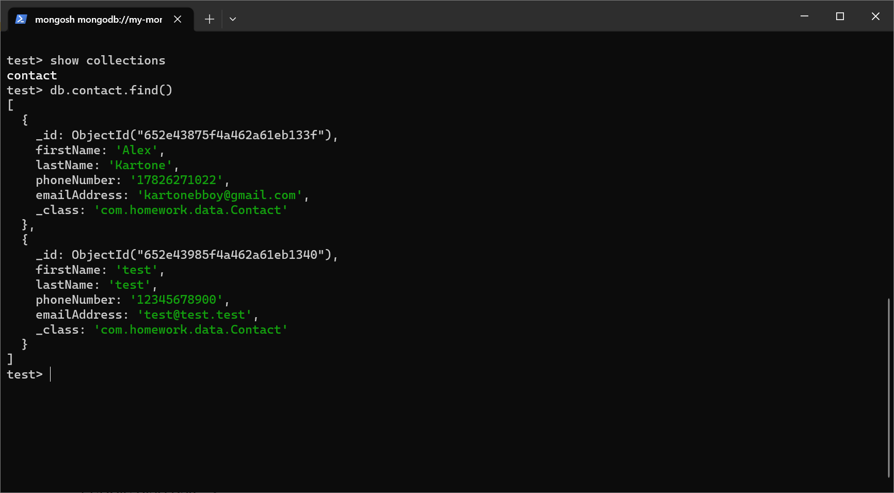

# Homework 06

使用非关系型数据库MongoDB做数据持久化。

浏览器访问应用，录入通讯录，然后访问MongoDB Shell，运行以下两个命令的截图：

* `show collections`
* `db.contact.find()`

添加联系人，注意id格式为UUID

`docker run -it --network mongo-net --rm mongo mongosh --host my-mongo` 访问MongoDB shell（docker中已经运行my-mongo容器的情况下）

