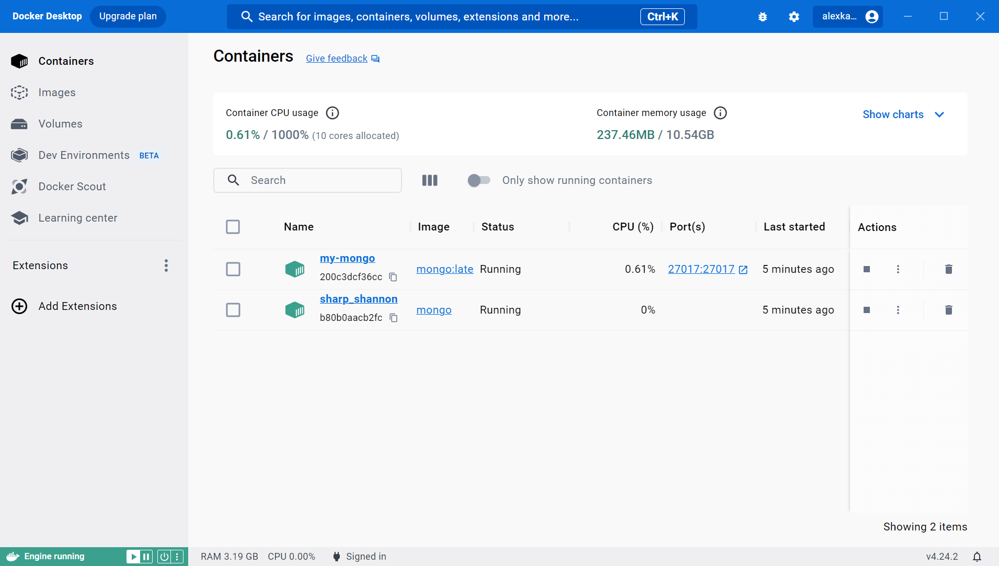
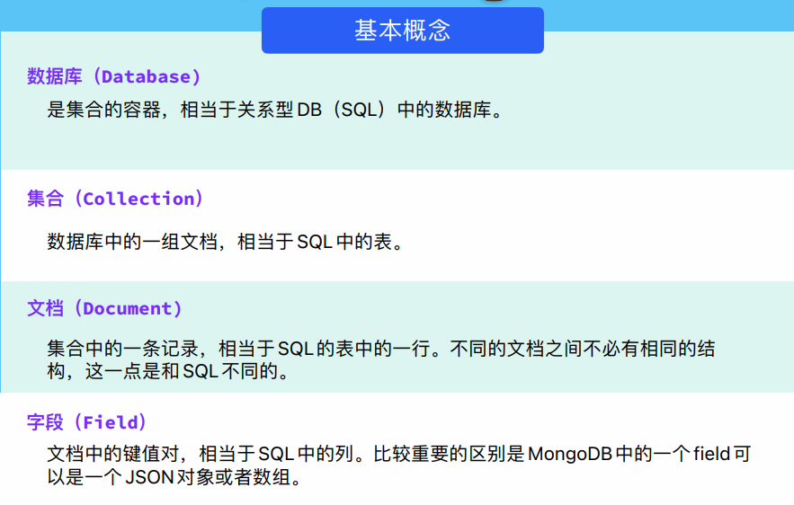
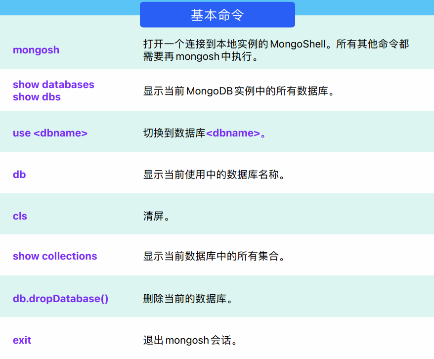
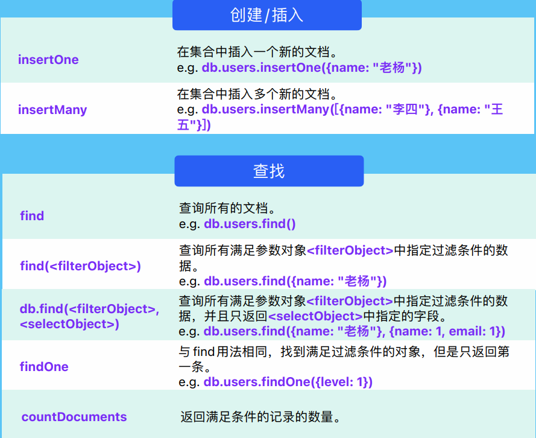

# MongoDB

## 依赖和配置

`pom.xml`引入依赖

```xml
<dependency>
    <groupId>org.springframework.boot</groupId>
    <artifactId>spring-boot-starter-data-mongodb</artifactId>
</dependency>
```

`mongodb`配置

```
spring:
  data:
    mongodb:
      uri: mongodb://localhost:27017/test	# test代表要访问的数据库
```

## 安装docker

reference: [Windows下安装docker](https://learn.microsoft.com/zh-cn/windows/wsl/tutorials/wsl-containers)

## Interact with MongoDB Shell

### 首次操作

首次操作按照老师PPT的步骤

1. `docker network create mongo-net`
2. `docker run --name my-mongo --network mongo-net -p 27017:27017 -d mongo:latest`
	* 若没有`mongo`镜像会自动下载，然后创建`my-mongo`实例
3. `docker run -it --network mongo-net --rm mongo mongosh --host my-mongo`

```powershell
PS C:\Users\estar> docker network create mongo-net
69871cd4ce6c8ad117501b1f0ab1bace466fe565581993a8a518c1826aa59467
PS C:\Users\estar> docker run --name my-mongo --network mongo-net -p 27017:27017 -d mongo:latest
Unable to find image 'mongo:latest' locally
latest: Pulling from library/mongo
43f89b94cd7d: Pull complete
54a7480baa9d: Pull complete
7f9301fbd7df: Pull complete
5e4470f2e90f: Pull complete
40d046ff8fd3: Pull complete
e062d62b861e: Pull complete
72919e34fde8: Pull complete
ab22810dfc64: Pull complete
fb05c29fbdf5: Pull complete
Digest: sha256:d341a86584b96eb665345a8f5b35fba8695ee1d0618fd012ec4696223a3d6c62
Status: Downloaded newer image for mongo:latest
200c3dcf36cc5a8f2204e020b81e33873c5ce32332bf7c1de4269c636950d275
PS C:\Users\estar> docker run --name my-mongo --network mongo-net -p 27017:27017 -d mongo:latest
docker: Error response from daemon: Conflict. The container name "/my-mongo" is already in use by container "200c3dcf36cc5a8f2204e020b81e33873c5ce32332bf7c1de4269c636950d275". You have to remove (or rename) that container to be able to reuse that name.
See 'docker run --help'.
PS C:\Users\estar> docker run -it --network mongo-net --rm mongo mongosh --host my-mongo
Current Mongosh Log ID: 652e1734a7c7d99091707be1
Connecting to:          mongodb://my-mongo:27017/?directConnection=true&appName=mongosh+2.0.1
Using MongoDB:          7.0.2
Using Mongosh:          2.0.1

For mongosh info see: https://docs.mongodb.com/mongodb-shell/


To help improve our products, anonymous usage data is collected and sent to MongoDB periodically (https://www.mongodb.com/legal/privacy-policy).
You can opt-out by running the disableTelemetry() command.

------
   The server generated these startup warnings when booting
   2023-10-17T05:09:26.806+00:00: Using the XFS filesystem is strongly recommended with the WiredTiger storage engine. See http://dochub.mongodb.org/core/prodnotes-filesystem
   2023-10-17T05:09:27.101+00:00: Access control is not enabled for the database. Read and write access to data and configuration is unrestricted
   2023-10-17T05:09:27.101+00:00: /sys/kernel/mm/transparent_hugepage/enabled is 'always'. We suggest setting it to 'never'
   2023-10-17T05:09:27.102+00:00: vm.max_map_count is too low
------

test>
```

还有一种方法：https://www.mongodb.com/docs/manual/tutorial/install-mongodb-community-with-docker/ 不过还没有验证

### 创建mongo实例后再次访问Mongosh

1. 在Docker Desktop中启动`my-mongo`实例
2. 终端输入 `docker run -it --network mongo-net --rm mongo mongosh --host my-mongo` 访问MongoDB Shell
   * `--rm` 表示在容器停止后立即删除容器



我们发现多出一个`sharp_shannon`容器，结合上文的`--rm`，猜测这与`mongosh`有关，当容器停止后便自动删除

当我们手动关闭这个容器后，发现终端中的Mongosh自动退出了：

```powershell
...
test>
PS C:\Users\estar>
```

## @Document和@Id

我们给Contact领域类注解`@Document`，和MongoDB的表结构对应起来，并且id用String的形式，因为MongoDB的`_id`采用UUID的格式存储

```java
@Data
@Document
public class Contact implements Serializable {
    @Id
    private String id;

    @NotNull
    @Size(min = 1, max=50, message = "姓名长度至少为2")
    private String firstName;
    
    ...
}
```

## @Repository

```java
package com.homework.dao;

import com.homework.data.Contact;
import org.springframework.data.repository.CrudRepository;
import org.springframework.stereotype.Repository;

@Repository
public interface ContactRepository extends CrudRepository<Contact, String> {
}
```

这里注意，我们不使用`JpaRepository`，使用`CrudRepository`，且id类型为String

* `CrudRepository`的find查询结果返回类型为`Iterable`，不是`List`

## MongoDB cheatsheet









